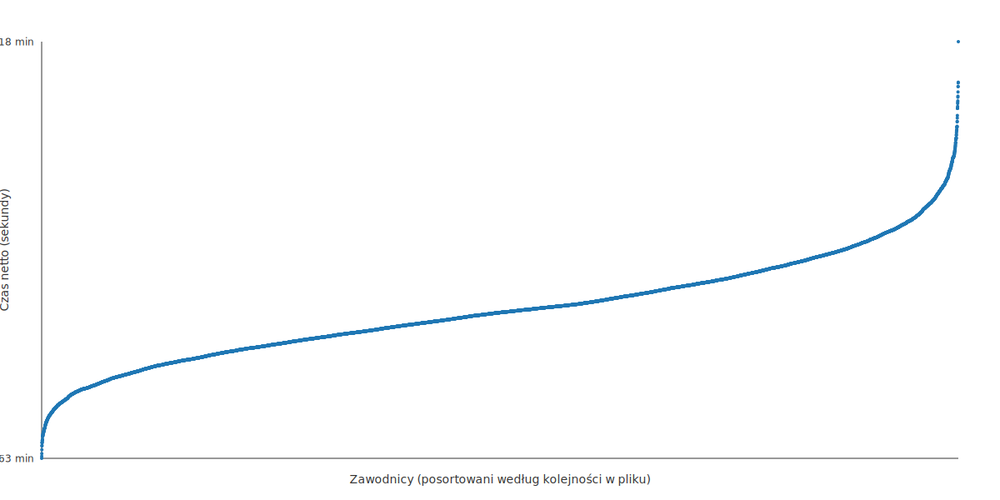
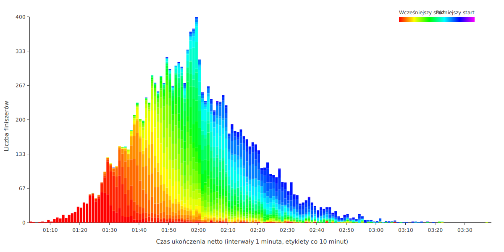

# datasport-results-analyzer

Generate SVG visualizations from `results.json` (a large race results data file):

1. Netto times scatter (`netto-times.svg`)
2. Netto times histogram (`histogram-netto-times.svg`)
3. Stacked finish vs start time histogram (`start-buckets-stacked.svg`)

## Data source (datasport.pl)

This tool is tailored for race result pages hosted at https://wyniki.datasport.pl.

How to obtain the JSON:

1. Open a results page in your browser, e.g.:
	https://wyniki.datasport.pl/results5710/show/
2. In the address bar replace the trailing `show/` (or `show` plus any filters) with `results.json` keeping the event id the same. Example:
	https://wyniki.datasport.pl/results5710/results.json
3. Save that file as `results.json` in the root of this repository (overwrite any existing one).
4. Run the scripts (see below) to produce the SVG visualizations.

Notes:
- If there are category filters in the URL, remove them before replacing; the JSON endpoint returns the full dataset.
- The field names (e.g. `czasnetto`, `msc`, `start`) come directly from the datasport JSON and are parsed as-is.

## Prerequisites

- Node.js 18+ (project uses ES Modules)
- `results.json` in the project root (already present)

## Install

```fish
npm install
```

## Generate all graphs

```fish
npm run graphs
```

This simply chains the three Node scripts (no external runner dependency) and produces the SVG files.

Outputs are written to the project root:

- `netto-times.svg`
- `histogram-netto-times.svg`
- `start-buckets-stacked.svg`

Scripts are located in the `src/` directory.

## Run individual scripts

```fish
npm run netto-times
npm run histogram-netto-times
npm run start-buckets-stacked
```

## Notes

- Scripts filter to finishers with non-zero placing and required time fields.
- All parsing is tolerant: malformed lines are skipped.
- Colors in the stacked histogram show earlier (red) to later (purple) start minutes.

## Sample output

Below are SVGs generated from the [11. PKO Cracovia Półmaraton Królewski](https://wyniki.datasport.pl/results5710/show/) dataset:

### Net finish times scatter
<p>
	
</p>

### Net finish time histogram
<p>
	
</p>

### Finish time vs start time (stacked)
<p>
	
</p>

## License

MIT (see `package.json`).
