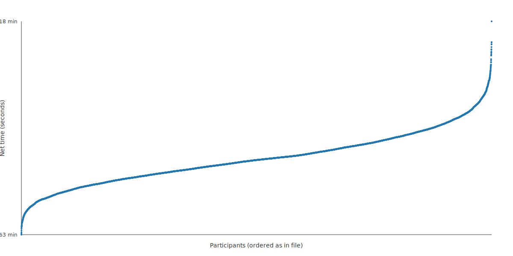
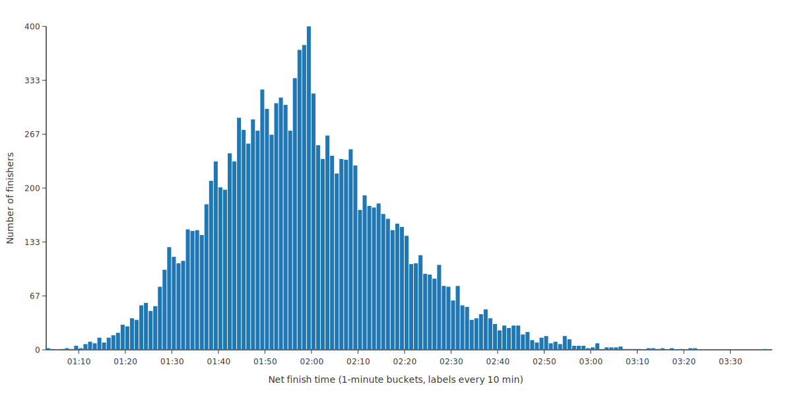

# datasport-results-analyzer

A web-based application for analyzing and visualizing race results from datasport.pl.

**🚀 [Open the app](https://bukowskiadam.github.io/datasport-results-analyzer/)**

Generate interactive SVG visualizations from race results data:

1. **Netto times scatter** - Each dot represents a finisher's net time
2. **Netto times histogram** - Distribution of finishers in 1-minute buckets
3. **Stacked finish vs start time histogram** - Finish times segmented by start minute
4. **Start vs finish time** - Compare start positions with finish time to spot overtaking patterns

## Features

- 🌐 **Web Interface** - Analyze results directly in your browser
- 💾 **Persistent Storage** - Save multiple race results for quick access (uses IndexedDB)
- 📊 **Three Visualizations** - Generate scatter plots and histograms
- 📝 **Metadata Management** - Rename stored results and track source URLs
- 🔗 **URL Tracking** - Link back to original datasport.pl pages
- 💻 **No Build Step** - Pure ES6 modules, runs directly in modern browsers

## Getting Started

### Quick Start

Visit the **[Live Demo](https://bukowskiadam.github.io/datasport-results-analyzer/)** to use the application immediately - no installation required!

### Option 1: Open Directly in Browser

1. Open `src/index.html` in your web browser
2. No build step or server required!

### Option 2: Using a Local Server

If you prefer using a local server:

```fish
# Using Python
python -m http.server 8000

# Using Node.js http-server
npx http-server

# Using PHP
php -S localhost:8000
```

Then navigate to `http://localhost:8000/src/`

## How to Use

### 1. Download Results Manually

Due to CORS restrictions, you'll need to download the JSON file:

1. Open a results page on datasport.pl, for example: https://wyniki.datasport.pl/results5710/show/
2. Enter the opened datasport.pl URL in the input field
3. Click **"Prepare Download"**
4. Click **"📄 Open results.json in New Tab"**
5. Save the file (Ctrl/Cmd + S or right-click → Save)

### 2. Upload and Analyze

1. Drag and drop the saved `results.json` file into the upload zone, or click **"Browse Files"**
2. The file is automatically saved to IndexedDB for future access
3. Three visualizations are generated instantly
4. Download individual SVGs using the buttons below each visualization

### 3. Manage Stored Results

Stored results are displayed as cards with:
- **Name** - Click to rename (inline editing)
- **Record count, file size, upload date**
- **Source URL** (if provided) - Link back to datasport.pl
- **Edit URL button (✏️)** - Add or update the source URL
- **Delete button (×)** - Remove individual result

Click any result card to load and analyze it again.

## Data Source (datasport.pl)

This tool is specifically designed for race result pages at https://wyniki.datasport.pl.

**Notes:**
- If the URL has category filters, remove them - the JSON endpoint returns the full dataset
- Field names (`czasnetto`, `msc`, `start`) come directly from datasport JSON
- Scripts filter to finishers with non-zero placing and valid time fields
- Malformed data is skipped gracefully

## Project Structure

```
datasport-results-analyzer/
├── src/
│   ├── index.html              # Main web interface
│   ├── styles.css              # Application styling
│   ├── app.js                  # Main controller
│   ├── storage.js              # IndexedDB persistence layer
│   ├── visualizations.js       # Visualization exports (re-exports from viz-* files)
│   ├── viz-netto-times.js      # Net times scatter plot generator
│   ├── viz-histogram.js        # Histogram visualization generator
│   ├── viz-start-buckets.js    # Stacked histogram generator
│   ├── utils.js                # Shared utilities
│   └── datasport-fetcher.js    # URL parsing utilities
├── results.json                # Sample data (optional)
├── package.json
└── README.md
```

## Technology Stack

- **Vanilla JavaScript (ES6+)** - No frameworks, no transpilation
- **ES Modules** - Native browser module support
- **IndexedDB** - Client-side persistent storage (handles large files >50MB)
- **SVG** - Scalable vector graphics generation
- **HTML5 & CSS3** - Modern web standards
- **GitHub Pages** - Hosted and deployed automatically

## Deployment

The application is automatically deployed to GitHub Pages on every push to the `master` branch. The deployment workflow:

1. Triggers on push to `master`
2. Uploads the `src/` directory as a static site
3. Deploys to `https://bukowskiadam.github.io/datasport-results-analyzer/`

The workflow is defined in `.github/workflows/deploy.yml`.

## Sample output

Below are SVGs generated from the [11. PKO Cracovia Półmaraton Królewski](https://wyniki.datasport.pl/results5710/show/) dataset:

### Net finish times scatter
<p>
	
</p>

### Net finish time histogram
<p>
	
</p>

### Finish time vs start time (stacked)
<p>
	
</p>

### Start vs finish time
<p>
	
</p>

## License

MIT (see `package.json`).
